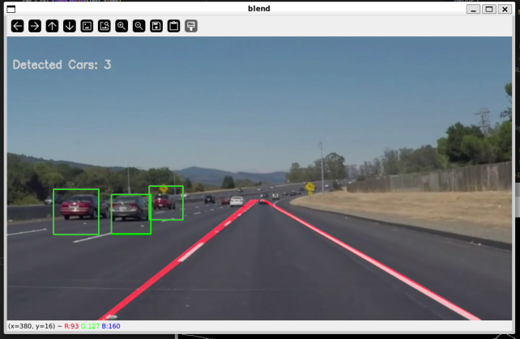

# Car detection using CANNY and dataset

To run the proyect, just use:

```bash
python main.py
```

This will pop up a window were you can visualize the results with each video you put in the `./data/test_videos` directory.

## Expected results

